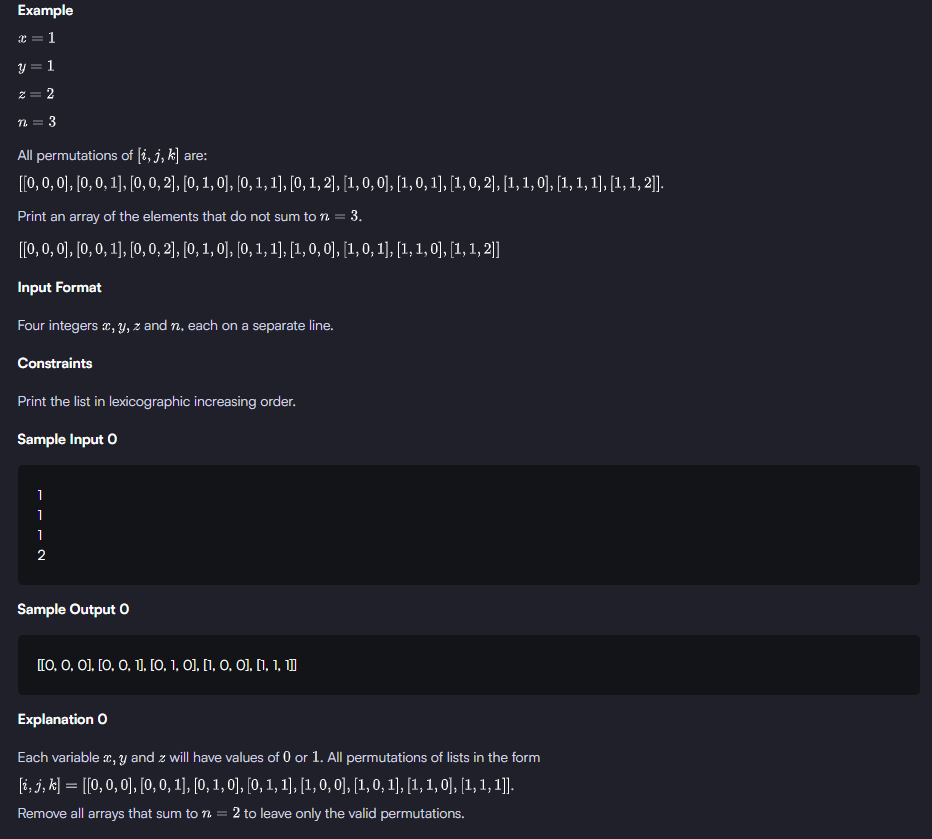

### HackerRank 

#### Q. Let's learn about list comprehensions! You are given three integers x,y and z representing the dimensions of a cuboid along with an integer n. Print a list of all possible coordinates given by (i,j,k) on a 3D grid where the sum of i+j+k is not equal to n. Here,0<=i<=x; 0<=j<=y; 0<=k<=z; . Please use list comprehensions rather than multiple loops, as a learning exercise.



```First Solution```

```python
print([[i, j, k] for i in range(x + 1) for j in range(y + 1) for k in range(z + 1) if i + j + k != n])

# Syntax with condition: 
 [expression for item in iterable if condition]

```


>- TC = O(x * y * z)
>- SC = O(x * y * z)

